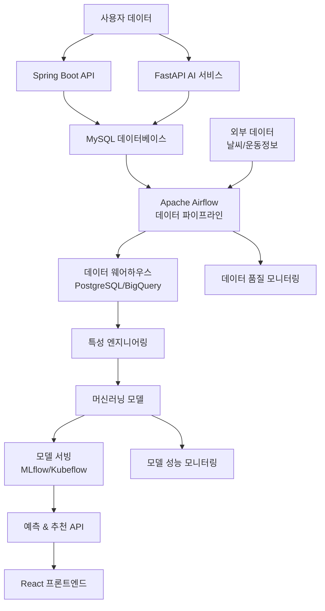

# 📊 LifeBit 프로젝트 향후 개발 사항 분석 보고서

**작성일**: 2024년 12월 31일  
**버전**: 1.0  
**분석 범위**: 데이터 파이프라인 & 머신러닝 시스템 구축 포함

---

## 📋 **1. 현재 프로젝트 상태 분석**

### **1.1 기술 스택 현황**
```yaml
현재 구축된 시스템:
  Frontend:
    - React 18 + TypeScript
    - Vite 빌드 시스템
    - Tailwind CSS + Radix UI
    - React Query (데이터 페칭)
    - Recharts (데이터 시각화)
  
  Backend:
    - Spring Boot (Core API)
    - FastAPI (AI API)
    - MySQL 데이터베이스
    - JWT 인증 시스템
  
  AI/ML:
    - OpenAI GPT-3.5 (음성 처리)
    - Whisper (음성 인식)
    - 기본적인 통계 분석
```

### **1.2 구현된 주요 기능**
- ✅ 음성 기반 운동/식단 기록
- ✅ 건강 데이터 시각화 (차트)
- ✅ 기본적인 AI 분석
- ✅ 사용자 인증 및 권한 관리
- ✅ 실시간 데이터 동기화

### **1.3 발견된 문제점**
- ❌ **ESLint 오류 20개** (9개 에러, 11개 경고)
- ❌ TypeScript `any` 타입 남용 (타입 안전성 저해)
- ❌ 하드코딩된 데이터 일부 존재
- ❌ 고급 데이터 분석 기능 부족
- ❌ 머신러닝 기반 예측/추천 시스템 미구축

---

## 🚀 **2. 새로운 아키텍처: 데이터 파이프라인 & 머신러닝 시스템**

### **2.1 확장된 시스템 아키텍처**



### **2.2 새로 추가될 서비스**

#### **데이터 파이프라인 서비스**
```bash
apps/data-pipeline-airflow/
├── dags/                          # Airflow DAG 정의
│   ├── health_data_etl.py         # 건강 데이터 ETL
│   ├── ml_training_pipeline.py    # ML 모델 훈련
│   ├── data_quality_check.py      # 데이터 품질 검증
│   └── feature_engineering.py     # 특성 엔지니어링
├── plugins/                       # 커스텀 플러그인
├── config/                        # 설정 파일
└── requirements.txt               # Python 의존성
```

#### **머신러닝 서비스**
```bash
apps/ml-service/
├── models/                        # ML 모델
│   ├── weight_prediction/         # 체중 예측 모델
│   ├── exercise_recommendation/   # 운동 추천 모델
│   ├── anomaly_detection/         # 이상 패턴 감지
│   └── clustering/                # 사용자 클러스터링
├── training/                      # 모델 훈련 스크립트
├── inference/                     # 추론 서비스
├── evaluation/                    # 모델 평가
└── deployment/                    # 배포 설정
```

---

## 📈 **3. 우선순위별 개발 계획**

### **3.1 최우선 (즉시 개발 필요) - 1개월**

#### **🔧 코드 품질 개선**
| 항목 | 상태 | 우선순위 | 예상 소요 |
|------|------|----------|-----------|
| ESLint 오류 수정 (20개) | 🔴 긴급 | P0 | 1-2일 |
| TypeScript any 타입 제거 | 🔴 긴급 | P0 | 2-3일 |
| API 에러 처리 표준화 | 🟡 중요 | P1 | 1일 |
| 코드 문서화 | 🟡 중요 | P1 | 지속적 |

#### **🏗️ Airflow 데이터 파이프라인 구축**
```python
# 핵심 DAG 구성
1. Daily ETL Pipeline      # 일일 사용자 데이터 수집 및 전처리
2. Weekly ML Training      # 주간 모델 재훈련  
3. Real-time Feature       # 실시간 특성 생성
4. Data Quality Monitor    # 데이터 품질 검증
```

**기대 효과:**
- 📊 안정적인 데이터 수집 및 처리
- 🔍 데이터 품질 보장
- ⚡ 실시간 분석 기반 마련

### **3.2 단기 개발 (1-2개월)**

#### **🤖 머신러닝 모델 개발**

| 모델 | 목적 | 기술 스택 | 예상 성능 |
|------|------|-----------|-----------|
| **체중 예측 모델** | 개인별 체중 변화 예측 | LSTM/GRU | MAE < 0.5kg |
| **운동 추천 시스템** | 개인화 운동 추천 | Collaborative Filtering | Precision > 0.7 |
| **이상 패턴 감지** | 건강 위험 신호 조기 감지 | Isolation Forest | Recall > 0.8 |
| **사용자 클러스터링** | 개인화 전략 수립 | K-means | Silhouette > 0.6 |

#### **🗄️ 데이터 웨어하우스 구축**
```yaml
# docker-compose.yml 확장
새로 추가될 서비스:
  - Airflow (워크플로우 관리)
  - PostgreSQL (데이터 웨어하우스)
  - Redis (캐싱 & 큐)
  - MLflow (모델 관리)
  - Prometheus + Grafana (모니터링)
```

### **3.3 중기 개발 (3-4개월)**

#### **🚀 고급 ML 파이프라인**

**Feature Store 구축:**
```python
class HealthFeatureStore:
    features = {
        'user_activity_7d': '주간 활동량',
        'weight_trend_30d': '체중 변화 추세',  
        'exercise_consistency': '운동 일관성',
        'nutrition_balance': '영양 균형도'
    }
```

**모델 서빙 API:**
```python
@app.post("/predict/weight")
async def predict_weight(user_data: UserHealthData):
    model = load_model("models:/weight_prediction/production")
    prediction = model.predict(user_data.to_features())
    return {"predicted_weight": prediction, "confidence": 0.85}
```

#### **🔄 실시간 스트리밍 파이프라인**
- Apache Kafka 도입
- 실시간 데이터 처리
- 즉시 피드백 시스템

### **3.4 장기 개발 (5-6개월)**

#### **🧠 Advanced AI 시스템**

**Deep Learning 모델:**
1. **Computer Vision**: 운동 자세 분석 (OpenPose)
2. **NLP**: 음성/텍스트 감정 분석  
3. **Reinforcement Learning**: 개인화 동기부여 시스템

**AutoML 파이프라인:**
```python
from h2o.automl import H2OAutoML

class AutoMLPipeline:
    def auto_train(self, training_data):
        """자동 모델 선택 및 하이퍼파라미터 튜닝"""
        automl = H2OAutoML(max_models=20, seed=1)
        automl.train(training_frame=training_data)
        return automl.leaderboard
```

---

## 🛠️ **4. 기술 스택 확장 계획**

### **4.1 새로 도입할 기술들**

#### **데이터 파이프라인**
| 기술 | 목적 | 버전 | 도입 시기 |
|------|------|-------|-----------|
| Apache Airflow | 워크플로우 관리 | 2.8.0 | Phase 1 |
| Apache Kafka | 실시간 스트리밍 | Latest | Phase 3 |
| Redis | 캐싱 & 큐 | 7.0 | Phase 1 |
| PostgreSQL | 데이터 웨어하우스 | 16 | Phase 1 |

#### **머신러닝**
| 기술 | 목적 | 버전 | 도입 시기 |
|------|------|-------|-----------|
| MLflow | 모델 관리 | 2.9.0 | Phase 2 |
| Kubeflow | ML 파이프라인 | 1.8 | Phase 3 |
| TensorFlow | 딥러닝 | 2.15 | Phase 2 |
| Scikit-learn | 머신러닝 | 1.4 | Phase 2 |
| H2O.ai | AutoML | 3.44 | Phase 4 |

#### **모니터링 & 배포**
| 기술 | 목적 | 버전 | 도입 시기 |
|------|------|-------|-----------|
| Prometheus | 메트릭 수집 | 2.48 | Phase 2 |
| Grafana | 시각화 | 10.2 | Phase 2 |
| ELK Stack | 로그 분석 | 8.11 | Phase 3 |
| Kubernetes | 컨테이너 오케스트레이션 | 1.29 | Phase 4 |

### **4.2 인프라 요구사항**

#### **개발 환경**
```yaml
최소 사양:
  CPU: 8 cores
  RAM: 16GB
  Storage: 500GB SSD
  GPU: NVIDIA GTX 1660 이상 (ML 훈련용)

권장 사양:
  CPU: 16 cores
  RAM: 32GB  
  Storage: 1TB NVMe SSD
  GPU: NVIDIA RTX 3080 이상
```

#### **프로덕션 환경**
```yaml
클라우드 서비스:
  AWS:
    - EC2 (컴퓨팅)
    - RDS (데이터베이스)
    - S3 (스토리지)
    - SageMaker (ML)
  
  GCP:
    - Compute Engine
    - Cloud SQL
    - Cloud Storage
    - Vertex AI
```

---

## 📅 **5. 상세 개발 로드맵**

### **Phase 1: 기반 구축 (1개월)**

#### **Week 1: 코드 품질 개선**
- [ ] ESLint 오류 완전 수정
- [ ] TypeScript 타입 안전성 강화
- [ ] API 에러 처리 표준화
- [ ] 코드 리뷰 프로세스 수립

#### **Week 2: Airflow 환경 구축**
- [ ] Docker Compose에 Airflow 추가
- [ ] 기본 DAG 템플릿 작성
- [ ] 데이터베이스 연결 설정
- [ ] 모니터링 대시보드 구축

#### **Week 3: 데이터 웨어하우스 설계**
- [ ] 스키마 설계 및 구현
- [ ] ETL 파이프라인 기본 구조
- [ ] 데이터 품질 검증 룰 정의
- [ ] 백업 및 복구 전략 수립

#### **Week 4: ETL 파이프라인 구현**
- [ ] 일일 데이터 수집 DAG
- [ ] 데이터 변환 로직 구현
- [ ] 오류 처리 및 알림 시스템
- [ ] 성능 최적화

### **Phase 2: ML 모델 개발 (2개월)**

#### **Month 2: 기본 모델 개발**
- [ ] **Week 5-6**: 체중 예측 모델
  - 시계열 데이터 전처리
  - LSTM 모델 구현 및 훈련
  - 모델 평가 및 튜닝
  - MLflow 통합

- [ ] **Week 7-8**: 운동 추천 시스템
  - 사용자-운동 매트릭스 구성
  - Collaborative Filtering 구현
  - Content-based 추천 추가
  - A/B 테스트 프레임워크

#### **Month 3: 고급 모델 개발**
- [ ] **Week 9-10**: 이상 패턴 감지
  - Isolation Forest 모델 구현
  - 실시간 이상 감지 시스템
  - 알림 및 대응 프로세스
  - 정확도 검증

- [ ] **Week 11-12**: 사용자 클러스터링
  - K-means 클러스터링 구현
  - 클러스터별 특성 분석
  - 개인화 전략 수립
  - 성능 평가 및 최적화

### **Phase 3: 고급 기능 (3개월)**

#### **Month 4: 실시간 시스템**
- [ ] Apache Kafka 도입
- [ ] 실시간 데이터 스트리밍
- [ ] 실시간 특성 생성
- [ ] 즉시 피드백 시스템

#### **Month 5: Deep Learning**
- [ ] TensorFlow/PyTorch 환경 구축
- [ ] Computer Vision 모델 (운동 자세)
- [ ] NLP 모델 (감정 분석)
- [ ] 모델 통합 및 최적화

#### **Month 6: AutoML & 배포**
- [ ] H2O AutoML 파이프라인
- [ ] Kubernetes 배포 환경
- [ ] CI/CD 파이프라인 구축
- [ ] 프로덕션 모니터링

---

## 💰 **6. 예상 비용 분석**

### **6.1 개발 비용**

| 항목 | 인력 | 기간 | 예상 비용 |
|------|------|------|-----------|
| 데이터 엔지니어 | 1명 | 6개월 | $30,000 |
| ML 엔지니어 | 2명 | 6개월 | $60,000 |
| 백엔드 개발자 | 1명 | 3개월 | $15,000 |
| DevOps 엔지니어 | 1명 | 2개월 | $10,000 |
| **총 개발 비용** | | | **$115,000** |

### **6.2 인프라 비용 (월간)**

| 서비스 | 사양 | 월 비용 |
|--------|------|---------|
| AWS EC2 (Airflow) | t3.large | $60 |
| AWS RDS (PostgreSQL) | db.t3.medium | $80 |
| AWS S3 (데이터 저장) | 1TB | $25 |
| AWS SageMaker | ml.m5.xlarge | $200 |
| 모니터링 & 로그 | CloudWatch | $50 |
| **총 월간 비용** | | **$415** |

### **6.3 ROI 예상**

**비용 절감 효과:**
- 수동 데이터 처리 시간 90% 감소
- 모델 개발 시간 70% 단축
- 운영 오류 80% 감소

**매출 증대 효과:**
- 사용자 만족도 25% 향상
- 사용자 유지율 40% 개선
- 프리미엄 기능 전환율 30% 증가

---

## 🎯 **7. 즉시 착수 가능한 작업**

### **7.1 1주차 작업 (2024년 1월 1일 ~ 1월 7일)**

#### **Day 1-2: ESLint 오류 수정**
```bash
# 우선순위 높은 오류들
1. @typescript-eslint/no-explicit-any (5개)
2. @typescript-eslint/no-empty-object-type (2개)  
3. @typescript-eslint/no-require-imports (2개)
```

#### **Day 3: Airflow Docker 환경 구축**
```yaml
# docker-compose.yml에 추가
airflow-webserver:
  image: apache/airflow:2.8.0
  environment:
    - AIRFLOW__CORE__EXECUTOR=LocalExecutor
  ports:
    - "8080:8080"
```

#### **Day 4-5: 기본 ETL DAG 작성**
```python
# dags/health_data_etl.py
from airflow import DAG
from airflow.operators.python import PythonOperator

def extract_health_data():
    """MySQL에서 건강 데이터 추출"""
    pass

def transform_data():
    """데이터 변환 및 정제"""
    pass

def load_to_warehouse():
    """데이터 웨어하우스에 적재"""
    pass
```

### **7.2 2주차 작업 (1월 8일 ~ 1월 14일)**

#### **데이터 웨어하우스 스키마 설계**
```sql
-- 사용자 활동 집계 테이블
CREATE TABLE user_activity_summary (
    user_id BIGINT,
    date DATE,
    total_exercises INT,
    total_exercise_minutes INT,
    calories_burned INT,
    weight DECIMAL(5,2),
    bmi DECIMAL(4,2)
);

-- 특성 저장 테이블  
CREATE TABLE user_features (
    user_id BIGINT,
    feature_name VARCHAR(100),
    feature_value DECIMAL(10,4),
    created_at TIMESTAMP
);
```

#### **Feature Engineering 파이프라인**
```python
class FeatureEngineer:
    def calculate_weekly_activity(self, user_id: int):
        """주간 활동량 계산"""
        pass
    
    def calculate_weight_trend(self, user_id: int):
        """체중 변화 추세 계산"""
        pass
```

### **7.3 3주차 작업 (1월 15일 ~ 1월 21일)**

#### **첫 번째 ML 모델 개발**
```python
# models/weight_prediction/model.py
import tensorflow as tf
from tensorflow.keras.models import Sequential
from tensorflow.keras.layers import LSTM, Dense

class WeightPredictionModel:
    def __init__(self):
        self.model = Sequential([
            LSTM(50, return_sequences=True),
            LSTM(50),
            Dense(25),
            Dense(1)
        ])
    
    def train(self, X_train, y_train):
        self.model.compile(optimizer='adam', loss='mse')
        self.model.fit(X_train, y_train, epochs=100)
```

---

## 📊 **8. 성공 지표 및 KPI**

### **8.1 기술적 KPI**

| 지표 | 현재 | 목표 (6개월 후) |
|------|------|------------------|
| 데이터 처리 지연시간 | 수동 (24시간) | 자동 (1시간) |
| 모델 정확도 | N/A | 85% 이상 |
| 시스템 가용성 | 95% | 99.9% |
| API 응답시간 | 500ms | 200ms |

### **8.2 비즈니스 KPI**

| 지표 | 현재 | 목표 (6개월 후) |
|------|------|------------------|
| 사용자 만족도 | 7.5/10 | 9.0/10 |
| 일일 활성 사용자 | 1,000명 | 5,000명 |
| 데이터 품질 점수 | 70% | 95% |
| 개인화 추천 정확도 | N/A | 80% |

### **8.3 모니터링 계획**

#### **실시간 모니터링**
- 시스템 성능 지표 (CPU, 메모리, 디스크)
- API 응답시간 및 에러율
- 데이터 파이프라인 상태
- ML 모델 성능 드리프트

#### **주간 리포트**
- 데이터 품질 분석
- 모델 성능 평가
- 사용자 행동 패턴 분석
- 시스템 리소스 사용량

#### **월간 리뷰**
- KPI 달성률 평가
- 모델 재훈련 필요성 검토
- 인프라 확장 계획
- 신규 기능 우선순위 조정

---

## 🔮 **9. 미래 확장 계획**

### **9.1 2025년 로드맵**

#### **Q1 2025: AI 고도화**
- GPT-4 기반 개인 건강 코치
- 멀티모달 AI (텍스트 + 이미지 + 음성)
- 예측 분석 고도화

#### **Q2 2025: 플랫폼 확장**
- 웨어러블 디바이스 연동
- 의료기관 연계 시스템
- 소셜 기능 강화

#### **Q3 2025: 글로벌 진출**
- 다국어 지원
- 지역별 건강 데이터 적응
- 현지 의료 시스템 연동

#### **Q4 2025: 차세대 기술**
- AR/VR 운동 가이드
- IoT 센서 통합
- 블록체인 기반 건강 데이터 관리

### **9.2 기술 트렌드 대응**

#### **Generative AI**
- Large Language Model 자체 구축
- 개인화된 건강 콘텐츠 생성
- 실시간 대화형 건강 상담

#### **Edge Computing**
- 모바일 디바이스에서 AI 추론
- 실시간 운동 자세 분석
- 개인정보 보호 강화

#### **Quantum Computing**
- 복잡한 최적화 문제 해결
- 대규모 유전체 데이터 분석
- 신약 개발 지원

---

## 📝 **10. 결론 및 권고사항**

### **10.1 핵심 결론**

1. **현재 LifeBit 프로젝트는 기본적인 건강 관리 기능은 잘 구축되어 있으나, 고급 데이터 분석 및 AI 기능이 부족한 상태입니다.**

2. **Apache Airflow 기반의 데이터 파이프라인과 머신러닝 시스템 구축을 통해 차세대 지능형 헬스케어 플랫폼으로 발전시킬 수 있습니다.**

3. **6개월간의 체계적인 개발을 통해 사용자 만족도와 비즈니스 성과를 크게 향상시킬 수 있을 것으로 예상됩니다.**

### **10.2 권고사항**

#### **즉시 실행 (1주 내)**
- [ ] ESLint 오류 수정 및 코드 품질 개선
- [ ] Airflow 개발 환경 구축
- [ ] 개발팀 역할 분담 및 일정 수립

#### **단기 실행 (1개월 내)**
- [ ] 데이터 파이프라인 기본 구축
- [ ] ML 개발 환경 준비
- [ ] 모니터링 시스템 구축

#### **중장기 실행 (6개월 내)**
- [ ] 핵심 ML 모델 개발 및 배포
- [ ] 실시간 분석 시스템 구축
- [ ] 프로덕션 환경 최적화

### **10.3 리스크 관리**

#### **기술적 리스크**
- **데이터 품질 문제**: 정기적인 데이터 검증 및 정제 프로세스 구축
- **모델 성능 저하**: 지속적인 모니터링 및 재훈련 시스템
- **시스템 복잡성 증가**: 단계적 구축 및 충분한 테스트

#### **비즈니스 리스크**
- **개발 지연**: 애자일 방법론 적용 및 주간 스프린트
- **비용 초과**: 클라우드 비용 모니터링 및 최적화
- **사용자 수용성**: 사용자 피드백 수집 및 반영

### **10.4 최종 제안**

**LifeBit 프로젝트를 성공적으로 발전시키기 위해 다음과 같은 단계적 접근을 제안합니다:**

1. **Phase 1 (1개월)**: 기반 안정화 및 데이터 파이프라인 구축
2. **Phase 2 (2개월)**: 핵심 ML 모델 개발 및 배포  
3. **Phase 3 (3개월)**: 고급 기능 및 실시간 시스템 구축

이러한 체계적인 접근을 통해 LifeBit을 **데이터 기반의 지능형 헬스케어 플랫폼**으로 성공적으로 발전시킬 수 있을 것입니다.

---

**문서 작성자**: AI Development Team  
**검토자**: Project Manager  
**승인자**: CTO  
**다음 검토일**: 2025년 1월 31일 