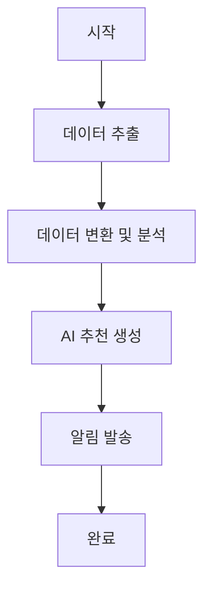

# LifeBit Airflow 데이터 파이프라인

## 📋 개요

LifeBit 건강 관리 플랫폼을 위한 **Apache Airflow 기반 데이터 분석 파이프라인**입니다.
매일 건강 데이터를 자동 수집하고 분석하여 개인화된 AI 추천을 제공합니다.

## 🏗️ 아키텍처

```
┌─────────────────┐    ┌─────────────────┐    ┌─────────────────┐
│   LifeBit DB    │───▶│   Airflow       │───▶│  AI 분석 결과   │
│  (PostgreSQL)   │    │  (Docker)       │    │   & 추천        │
└─────────────────┘    └─────────────────┘    └─────────────────┘
```

## 🔄 데이터 플로우

1. **Extract**: LifeBit PostgreSQL DB에서 건강 데이터 추출
2. **Transform**: 데이터 정제 및 분석 지표 계산
3. **Analyze**: 건강 패턴 분석 및 통계 생성
4. **Recommend**: 규칙 기반 AI 건강 추천 생성
5. **Notify**: 분석 결과 알림 및 로깅

## 💰 비용 구조

### 현재 환경 (로컬)
- **총 비용**: **$0/월** 🎉
- **데이터베이스**: 기존 LifeBit PostgreSQL 활용
- **컴퓨팅**: Docker Desktop (로컬)
- **스토리지**: 로컬 디스크

### 클라우드 확장 시 (예상)
- **AWS EC2 t3.micro**: ~$8/월
- **RDS PostgreSQL t3.micro**: ~$15/월
- **총 예상 비용**: **~$23/월** 💪

## 🚀 빠른 시작

### 전제 조건

- Docker Desktop 설치 및 실행
- LifeBit 프로젝트 실행 중 (PostgreSQL DB 접근 가능)
- PowerShell (Windows) 또는 Bash (Linux/Mac)

### 1. 설치 및 실행

```powershell
# 1. Airflow 디렉토리로 이동
cd apps/airflow-pipeline

# 2. 자동 설치 스크립트 실행 (권장)
./start-airflow.ps1

# 또는 수동 실행
docker-compose up -d
```

### 2. 초기 설정 확인

```powershell
# 컨테이너 상태 확인
docker-compose ps

# 로그 확인
docker-compose logs -f
```

### 3. 접속 정보

- **Airflow 웹 UI**: http://localhost:8081
- **사용자명**: `admin`
- **비밀번호**: `admin123!`
- **PostgreSQL**: `localhost:5433`

### 4. DAG 실행

1. Airflow UI에 접속
2. `lifebit_health_analytics_pipeline` DAG 찾기
3. 토글 버튼으로 DAG 활성화
4. "Trigger DAG" 버튼으로 수동 실행

## 📊 DAG 구조

### `lifebit_health_analytics_pipeline`



#### 태스크 설명

1. **extract_health_data**: PostgreSQL에서 건강 데이터 추출
2. **transform_and_analyze_data**: 데이터 분석 및 통계 계산
3. **generate_ai_recommendations**: 규칙 기반 건강 추천 생성
4. **send_summary_notification**: 분석 결과 로깅

## 🔧 설정

### 환경 변수 (.env)

```env
# 데이터베이스 연결 (PostgreSQL)
LIFEBIT_DB_HOST=host.docker.internal
LIFEBIT_DB_PORT=5432
LIFEBIT_DB_NAME=lifebit_db
LIFEBIT_DB_USER=lifebit_user
LIFEBIT_DB_PASSWORD=lifebit_password

# API 연결
LIFEBIT_API_BASE_URL=http://localhost:8080
LIFEBIT_AI_API_URL=http://localhost:8000

# Airflow 관리자
_AIRFLOW_WWW_USER_USERNAME=admin
_AIRFLOW_WWW_USER_PASSWORD=admin123!
```

### 스케줄 설정

- **기본 스케줄**: 매일 실행 (`@daily`)
- **수정 방법**: DAG 파일에서 `schedule_interval` 변경

```python
# 매시간 실행
schedule_interval='@hourly'

# 매주 실행
schedule_interval='@weekly'

# 크론 표현식 사용
schedule_interval='0 2 * * *'  # 매일 새벽 2시
```

## 📈 모니터링

### Airflow UI에서 확인 가능한 정보

- **DAG 실행 상태**: 성공/실패/진행중
- **태스크별 로그**: 각 단계의 상세 로그
- **실행 시간**: 성능 모니터링
- **데이터 통계**: XCom을 통한 중간 결과 확인

### 로그 확인

```powershell
# 전체 로그
docker-compose logs -f

# 특정 서비스 로그
docker-compose logs -f airflow-scheduler
docker-compose logs -f airflow-webserver
```

## 🛠️ 개발 가이드

### 새로운 DAG 추가

1. `dags/` 디렉토리에 Python 파일 생성
2. DAG 정의 및 태스크 작성
3. Airflow UI에서 자동 감지 확인

### 커스텀 오퍼레이터 추가

1. `plugins/` 디렉토리에 플러그인 코드 작성
2. Docker 컨테이너 재시작
3. Airflow UI에서 플러그인 확인

### 의존성 추가

1. `requirements.txt`에 패키지 추가
2. Docker 이미지 재빌드

```powershell
docker-compose down
docker-compose build --no-cache
docker-compose up -d
```

## 🔒 보안 설정

### 프로덕션 환경 보안

- 기본 비밀번호 변경
- 네트워크 접근 제한
- HTTPS 설정
- 데이터베이스 암호화

### 환경별 설정 분리

```
.env.development
.env.staging  
.env.production
```

## 🚨 문제 해결

### 일반적인 문제

#### 1. Docker 컨테이너가 시작되지 않음
```powershell
# 로그 확인
docker-compose logs

# 컨테이너 상태 확인
docker-compose ps

# 강제 재시작
docker-compose down -v
docker-compose up -d
```

#### 2. 데이터베이스 연결 실패
- LifeBit PostgreSQL 서버 실행 상태 확인
- 방화벽 설정 확인
- 연결 정보 재확인

#### 3. DAG가 표시되지 않음
- `dags/` 디렉토리 권한 확인
- Python 문법 오류 확인
- Airflow 스케줄러 재시작

### 성능 최적화

#### 리소스 사용량 줄이기
```yaml
# docker-compose.yml에서 리소스 제한
services:
  airflow-webserver:
    deploy:
      resources:
        limits:
          memory: 512M
          cpus: '0.5'
```

#### 동시 실행 제한
```python
# DAG에서 동시 실행 제한
max_active_tasks=2
max_active_runs=1
```

## 📚 참고 자료

- [Apache Airflow 공식 문서](https://airflow.apache.org/docs/)
- [Docker Compose 가이드](https://docs.docker.com/compose/)
- [LifeBit 프로젝트 문서](../README.md)

## 🤝 기여하기

1. Fork 프로젝트
2. 새 브랜치 생성: `git checkout -b feature/new-pipeline`
3. 변경사항 커밋: `git commit -m 'Add new pipeline'`
4. 브랜치 푸시: `git push origin feature/new-pipeline`
5. Pull Request 생성

## 📄 라이선스

이 프로젝트는 LifeBit 프로젝트의 일부로 관리됩니다. 