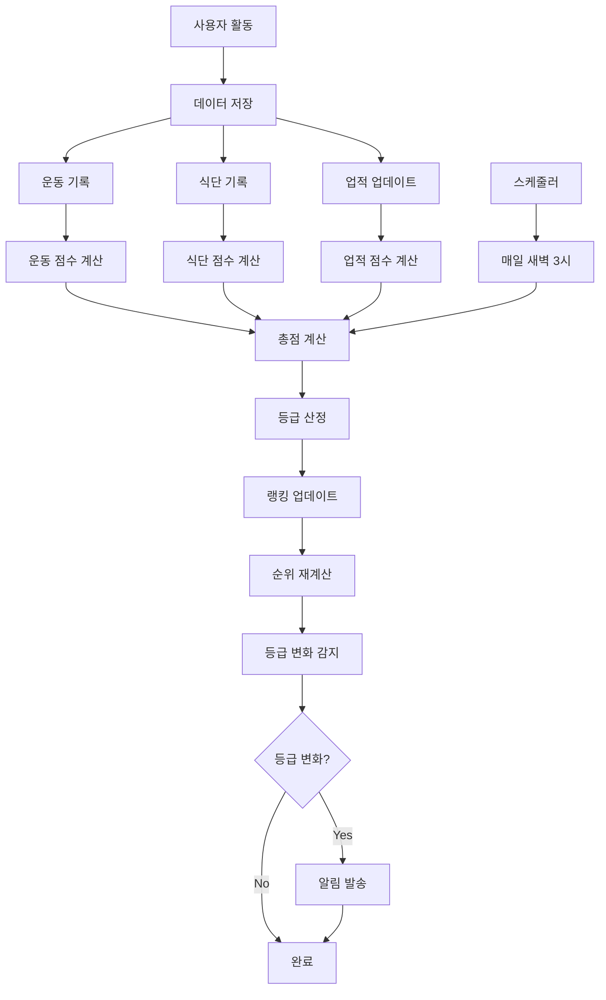

# LifeBit 랭킹 등급 산정 로직 가이드

## 📋 목차
1. [개요](#개요)
2. [랭킹 시스템 구성](#랭킹-시스템-구성)
3. [점수 측정 방식](#점수-측정-방식)
4. [등급 산정 기준](#등급-산정-기준)
5. [데이터 흐름도](#데이터-흐름도)
6. [실제 구현 코드](#실제-구현-코드)
7. [업적 시스템](#업적-시스템)
8. [보상 시스템](#보상-시스템)

---

## 🎯 개요

LifeBit의 랭킹 시스템은 사용자의 건강 관리 활동을 종합적으로 평가하여 점수를 산정하고, 이를 바탕으로 등급을 부여하는 시스템입니다. 운동, 식단, 출석, 업적 등 다양한 활동이 점수에 반영됩니다.

### 핵심 특징
- **실시간 점수 계산**: 사용자의 활동이 즉시 반영
- **다차원 평가**: 운동, 식단, 출석, 업적을 종합적으로 평가
- **등급 시스템**: 9단계 등급으로 사용자 동기부여
- **자동 갱신**: 매일 새벽 3시에 전체 랭킹 자동 갱신

---

## 🏗️ 랭킹 시스템 구성

### 데이터베이스 구조
```
user_ranking (사용자 랭킹 테이블)
├── user_id: 사용자 ID
├── total_score: 총 점수
├── rank_position: 현재 순위
├── streak_days: 연속 기록 일수
├── tier: 등급 (UNRANK, BRONZE, SILVER, GOLD, PLATINUM, DIAMOND, MASTER, GRANDMASTER, CHALLENGER)
├── season: 시즌 번호
└── last_updated_at: 마지막 갱신 시간

ranking_history (랭킹 히스토리 테이블)
├── user_ranking_id: 랭킹 참조
├── total_score: 기록 당시 점수
├── rank_position: 기록 당시 순위
├── season: 시즌 번호
└── recorded_at: 기록 시간
```

### 등급별 색상 및 설명
| 등급 | 색상 코드 | 한글명 | 설명 | 점수 기준 |
|------|-----------|--------|------|-----------|
| UNRANK | #bdbdbd | 언랭크 | 아직 랭킹 기록이 없음 | 0점 |
| BRONZE | #cd7f32 | 브론즈 | 기본 활동 등급 | 100-999점 |
| SILVER | #c0c0c0 | 실버 | 꾸준한 활동 등급 | 1,000-1,999점 |
| GOLD | #ffd700 | 골드 | 상위 30% 등급 | 2,000-2,999점 |
| PLATINUM | #e5e4e2 | 플래티넘 | 상위 15% 등급 | 3,000-3,999점 |
| DIAMOND | #00bfff | 다이아 | 상위 7% 등급 | 4,000-4,999점 |
| MASTER | #a020f0 | 마스터 | 상위 3% 등급 | 5,000-5,999점 |
| GRANDMASTER | #ff4500 | 그랜드마스터 | 상위 1% 등급 | 6,000-6,999점 |
| CHALLENGER | #ff1493 | 챌린저 | 최상위 0.1% 등급 | 7,000점 이상 |

---

## 📊 점수 측정 방식

### 총점 계산 공식
```
총점 = 운동점수 + 식단점수 + 출석점수 + 업적점수
```

### 1. 운동 점수 (최근 7일 기준)
```
운동점수 = (총 운동 시간(분) × 2) + (총 칼로리 소모 × 0.5)
```

**측정 항목:**
- **운동 시간**: `exercise_sessions` 테이블의 `duration_minutes` 합계
- **칼로리 소모**: `exercise_sessions` 테이블의 `calories_burned` 합계
- **기간**: 최근 7일간의 기록

**예시:**
- 7일간 총 300분 운동 + 1,500칼로리 소모
- 점수: (300 × 2) + (1,500 × 0.5) = 600 + 750 = 1,350점

### 2. 식단 점수 (최근 7일 기준)
```
식단점수 = 목표 영양소 달성률(%)
```

**측정 항목:**
- **탄수화물**: 목표 200g/일 대비 달성률
- **단백질**: 목표 120g/일 대비 달성률  
- **지방**: 목표 60g/일 대비 달성률
- **칼로리**: 목표 1,500kcal/일 대비 달성률

**계산 방식:**
```java
// 4개 항목의 평균 달성률 계산
double carbsRate = Math.min(100, totalCarbs / targetCarbs * 100);
double proteinRate = Math.min(100, totalProtein / targetProtein * 100);
double fatRate = Math.min(100, totalFat / targetFat * 100);
double caloriesRate = Math.min(100, totalCalories / targetCalories * 100);

int avgRate = (int) Math.round((carbsRate + proteinRate + fatRate + caloriesRate) / 4.0);
```

**예시:**
- 탄수화물 80%, 단백질 90%, 지방 70%, 칼로리 85% 달성
- 점수: (80 + 90 + 70 + 85) ÷ 4 = 81점

### 3. 출석 점수
```
출석점수 = 연속 기록 일수 × 10
```

**측정 항목:**
- **연속 기록**: `user_ranking` 테이블의 `streak_days` 값
- **기준**: 운동 또는 식단 기록 중 하나라도 있으면 해당 일은 출석으로 인정

**예시:**
- 15일 연속 기록
- 점수: 15 × 10 = 150점

### 4. 업적 점수
```
업적점수 = 달성한 업적 개수 × 50
```

**측정 항목:**
- **달성 업적**: `user_achievements` 테이블에서 `is_achieved = true`인 개수
- **업적 종류**: 연속 운동, 총 운동 일수, 첫 운동 등

**예시:**
- 3개 업적 달성
- 점수: 3 × 50 = 150점

---

## 🏆 등급 산정 기준

### 등급별 점수 구간
```java
public RankingTier calculateTier(int totalScore) {
    if (totalScore == 0) return RankingTier.UNRANK;
    if (totalScore < 1000) return RankingTier.BRONZE;
    if (totalScore < 2000) return RankingTier.SILVER;
    if (totalScore < 3000) return RankingTier.GOLD;
    if (totalScore < 4000) return RankingTier.PLATINUM;
    if (totalScore < 5000) return RankingTier.DIAMOND;
    if (totalScore < 6000) return RankingTier.MASTER;
    if (totalScore < 7000) return RankingTier.GRANDMASTER;
    return RankingTier.CHALLENGER;
}
```

### 등급 변화 알림
- 등급이 상승/하락할 때 자동으로 알림 발송
- 알림 타입: `TIER_CHANGE`
- 메시지: "등급이 [이전등급]에서 [새등급]로 변경되었습니다."

---

## 🔄 데이터 흐름도



### 실시간 점수 계산 흐름
1. **사용자 활동 기록**
   - 운동 세션 등록
   - 식단 기록 등록
   - 업적 달성

2. **점수 계산 트리거**
   - 활동 기록 시 즉시 점수 재계산
   - 스케줄러를 통한 정기 갱신

3. **랭킹 업데이트**
   - 총점 계산
   - 등급 산정
   - 순위 재계산

4. **알림 발송**
   - 등급 변화 시 알림
   - 업적 달성 시 알림

---

## 💻 실제 구현 코드

### 총점 계산 메서드
```java
public int calculateTotalScore(Long userId) {
    // 1. 운동 점수: 최근 7일간 총 운동 시간(분) ×2 + 칼로리 소모(0.5)
    int exerciseMinutes = exerciseService.getExerciseMinutesByPeriod(userId, 7);
    int caloriesBurned = exerciseService.getCaloriesBurnedByPeriod(userId, 7);
    int exerciseScore = exerciseMinutes * 2 + (int)(caloriesBurned * 0.5);

    // 2. 식단 점수: 최근 7일간 목표 영양소 달성률(%) ×1
    int mealAchievementRate = mealService.getWeeklyNutritionAchievementRate(userId);
    int mealScore = mealAchievementRate;

    // 3. 출석 점수: streakDays ×10
    int streakDays = userRankingRepository.findByUserId(userId)
        .map(UserRanking::getStreakDays).orElse(0);
    int streakScore = streakDays * 10;

    // 4. 업적 점수: 달성 업적 개수 ×50
    int achievementCount = achievementService.getUserAchievementCount(userId);
    int achievementScore = achievementCount * 50;

    return exerciseScore + mealScore + streakScore + achievementScore;
}
```

### 식단 점수 계산 메서드
```java
public int getWeeklyNutritionAchievementRate(Long userId) {
    LocalDate endDate = LocalDate.now();
    LocalDate startDate = endDate.minusDays(6);
    
    List<MealLog> mealLogs = mealLogRepository
        .findByUserAndLogDateBetweenOrderByLogDateDesc(user, startDate, endDate);
    
    if (mealLogs.isEmpty()) return 0;

    // 목표값 설정
    double targetCarbs = 200 * 7;    // 7일간 목표
    double targetProtein = 120 * 7;
    double targetFat = 60 * 7;
    double targetCalories = 1500 * 7;

    // 실제 섭취량 계산
    double totalCarbs = 0, totalProtein = 0, totalFat = 0, totalCalories = 0;
    for (MealLog log : mealLogs) {
        FoodItem food = log.getFoodItem();
        double qty = log.getQuantity() != null ? log.getQuantity().doubleValue() : 1.0;
        
        totalCarbs += food.getCarbs() != null ? food.getCarbs().doubleValue() * qty / 100.0 : 0;
        totalProtein += food.getProtein() != null ? food.getProtein().doubleValue() * qty / 100.0 : 0;
        totalFat += food.getFat() != null ? food.getFat().doubleValue() * qty / 100.0 : 0;
        totalCalories += food.getCalories() != null ? food.getCalories().doubleValue() * qty / 100.0 : 0;
    }
    
    // 달성률 계산 (최대 100% 제한)
    double carbsRate = Math.min(100, totalCarbs / targetCarbs * 100);
    double proteinRate = Math.min(100, totalProtein / targetProtein * 100);
    double fatRate = Math.min(100, totalFat / targetFat * 100);
    double caloriesRate = Math.min(100, totalCalories / targetCalories * 100);
    
    // 4개 항목 평균
    return (int) Math.round((carbsRate + proteinRate + fatRate + caloriesRate) / 4.0);
}
```

### 스케줄러를 통한 자동 갱신
```java
@Scheduled(cron = "0 0 3 * * *")  // 매일 새벽 3시
@Transactional
public void scheduledRankingUpdate() {
    log.info("[스케줄러] 전체 사용자 랭킹 자동 갱신 시작");
    
    List<UserRanking> allRankings = userRankingRepository.findAll();
    int rank = 1;
    
    for (UserRanking ranking : allRankings) {
        int prevScore = ranking.getTotalScore();
        RankingTier prevTier = ranking.getTier();

        // 1. 점수/등급 재계산
        int newScore = calculateTotalScore(ranking.getUserId());
        RankingTier newTier = calculateTier(newScore);
        
        ranking.setPreviousRank(ranking.getRankPosition());
        ranking.setRankPosition(rank++);
        ranking.setTotalScore(newScore);
        ranking.setTier(newTier);
        ranking.setLastUpdatedAt(LocalDateTime.now());

        // 2. 등급 변화 감지 시 알림 전송
        if (prevTier != newTier) {
            notificationService.saveNotification(
                ranking.getUserId(), 
                "TIER_CHANGE", 
                "등급 변화 알림", 
                String.format("등급이 %s에서 %s로 변경되었습니다.", prevTier.name(), newTier.name())
            );
        }
    }
    
    userRankingRepository.saveAll(allRankings);
    log.info("[스케줄러] 전체 사용자 랭킹 자동 갱신 완료: {}명", allRankings.size());
}
```

---

## 🏅 업적 시스템

### 업적 종류
| 업적 타입 | 제목 | 목표값 | 설명 |
|-----------|------|--------|------|
| STREAK_7 | 주간 전사 | 7일 | 7일 연속 운동 |
| STREAK_30 | 월간 마스터 | 30일 | 30일 연속 운동 |
| STREAK_90 | 3개월 챌린지 | 90일 | 90일 연속 운동 |
| STREAK_180 | 6개월 레전드 | 180일 | 180일 연속 운동 |
| TOTAL_WORKOUT_DAYS | 운동 애호가 | 50일 | 총 50일 운동 |
| WEEKLY_EXERCISE | 주간 전사 | 7회 | 주간 7회 운동 |
| MONTHLY_EXERCISE | 월간 마스터 | 30회 | 월간 30회 운동 |
| FIRST_EXERCISE | 첫 걸음 | 1회 | 첫 운동 기록 |
| FIRST_MEAL | 식단 시작 | 1회 | 첫 식단 기록 |

### 업적 점수 계산
```java
@Transactional(readOnly = true)
public int getUserAchievementCount(Long userId) {
    return (int) userAchievementRepository.findByUserIdWithAchievements(userId)
        .stream()
        .filter(ua -> Boolean.TRUE.equals(ua.getIsAchieved()))
        .count();
}
```

### 업적 달성 시 알림
```java
if (achievement.getTargetDays() != null && progress >= achievement.getTargetDays() && !userAchievement.getIsAchieved()) {
    userAchievement.setIsAchieved(true);
    userAchievement.setAchievedDate(LocalDate.now());
    
    notificationService.saveNotification(
        userId, 
        "ACHIEVEMENT", 
        "업적 달성", 
        String.format("'%s' 업적을 달성했습니다! 🎉", achievement.getTitle())
    );
}
```

---

## 🎁 보상 시스템

### 시즌 보상
| 순위 | 보상 포인트 | 설명 |
|------|-------------|------|
| 1위 | 10,000점 | 시즌 챔피언 |
| 2위 | 5,000점 | 시즌 준우승 |
| 3위 | 2,000점 | 시즌 3위 |

### 연속 기록 보상
| 연속 일수 | 보상 포인트 | 설명 |
|-----------|-------------|------|
| 7일 | 100점 | 주간 연속 기록 |
| 30일 | 500점 | 월간 연속 기록 |
| 100일 | 2,000점 | 100일 연속 기록 |

### 보상 지급 로직
```java
@Transactional(readOnly = true)
public RankingRewardDto getMyReward(Long userId) {
    UserRanking myRanking = userRankingRepository.findByUserId(userId)
        .orElseGet(() -> createDefaultRanking(userId));
    
    int reward = 0;
    if (myRanking.getRankPosition() == 1) reward = 10000;
    else if (myRanking.getRankPosition() == 2) reward = 5000;
    else if (myRanking.getRankPosition() == 3) reward = 2000;
    
    return RankingRewardDto.builder()
        .userId(userId)
        .rankPosition(myRanking.getRankPosition())
        .totalScore(myRanking.getTotalScore())
        .rewardType("personal")
        .rewardPoints(reward)
        .build();
}
```

---

## 📈 성능 최적화

### 인덱스 설정
```sql
-- 랭킹 조회 성능 향상
CREATE INDEX IF NOT EXISTS idx_user_ranking_total_score ON user_ranking(total_score DESC);
CREATE INDEX IF NOT EXISTS idx_user_ranking_user_id ON user_ranking(user_id);
```

### 캐시 활용
- 랭킹 데이터 캐싱
- 상위 랭커 목록 캐싱
- 업적 정보 캐싱

### 배치 처리
- 스케줄러를 통한 일괄 처리
- 트랜잭션 최적화
- 메모리 사용량 관리

---

## 🔧 설정 및 커스터마이징

### 점수 가중치 조정
```java
// 운동 점수 가중치
private static final int EXERCISE_TIME_MULTIPLIER = 2;
private static final double CALORIES_MULTIPLIER = 0.5;

// 출석 점수 가중치
private static final int STREAK_MULTIPLIER = 10;

// 업적 점수 가중치
private static final int ACHIEVEMENT_MULTIPLIER = 50;
```

### 등급 기준 조정
```java
// 등급별 점수 기준 (필요시 조정 가능)
private static final int BRONZE_THRESHOLD = 1000;
private static final int SILVER_THRESHOLD = 2000;
private static final int GOLD_THRESHOLD = 3000;
// ... 기타 등급 기준
```

---

## 📝 결론

LifeBit의 랭킹 시스템은 다음과 같은 특징을 가지고 있습니다:

1. **공정한 평가**: 운동, 식단, 출석, 업적을 종합적으로 평가
2. **실시간 반영**: 사용자 활동이 즉시 점수에 반영
3. **동기부여**: 9단계 등급 시스템으로 지속적인 동기부여
4. **자동화**: 스케줄러를 통한 자동 갱신 및 알림
5. **확장성**: 새로운 업적이나 평가 기준 추가 가능

이 시스템을 통해 사용자들은 건강한 생활 습관을 형성하고 지속할 수 있는 강력한 동기부여를 받을 수 있습니다. 